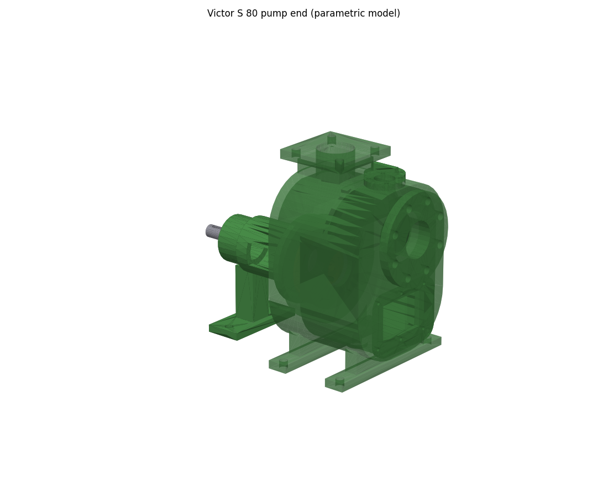
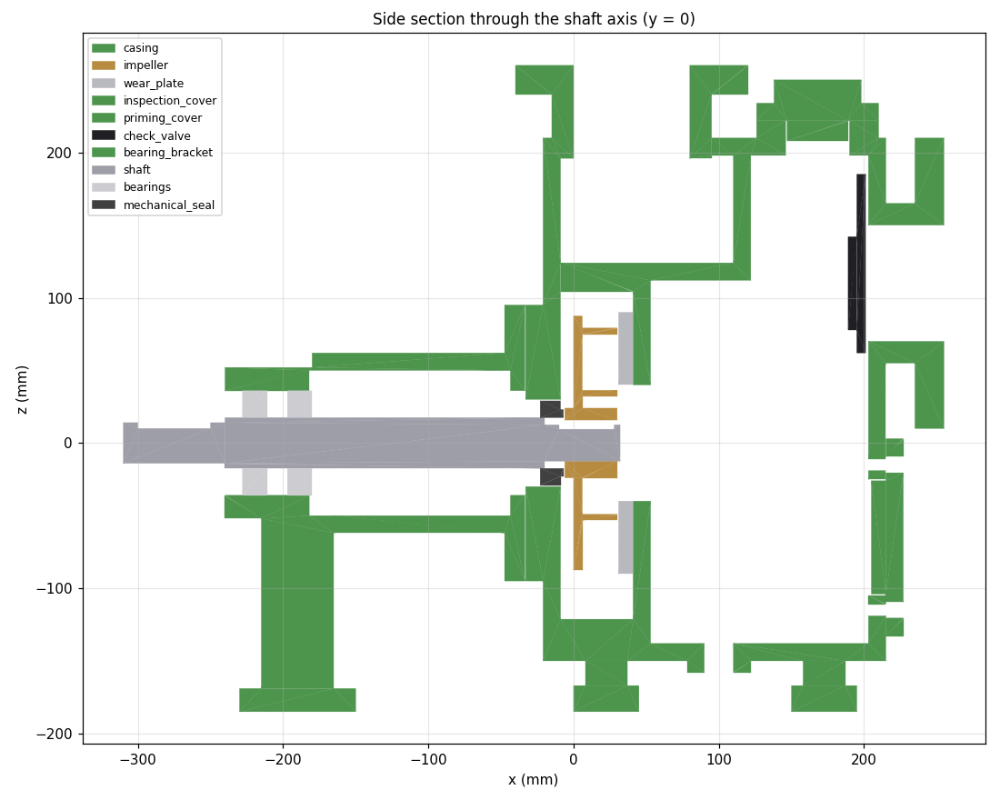
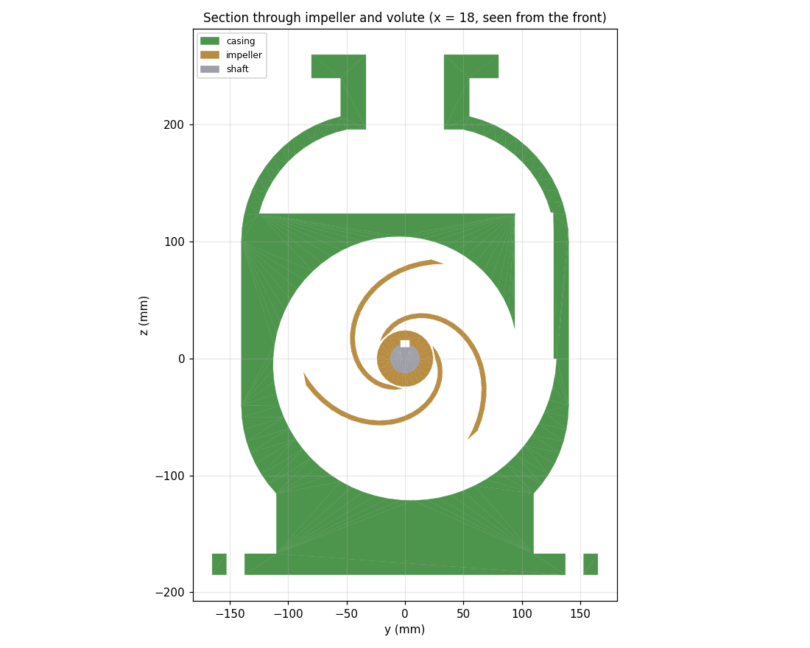
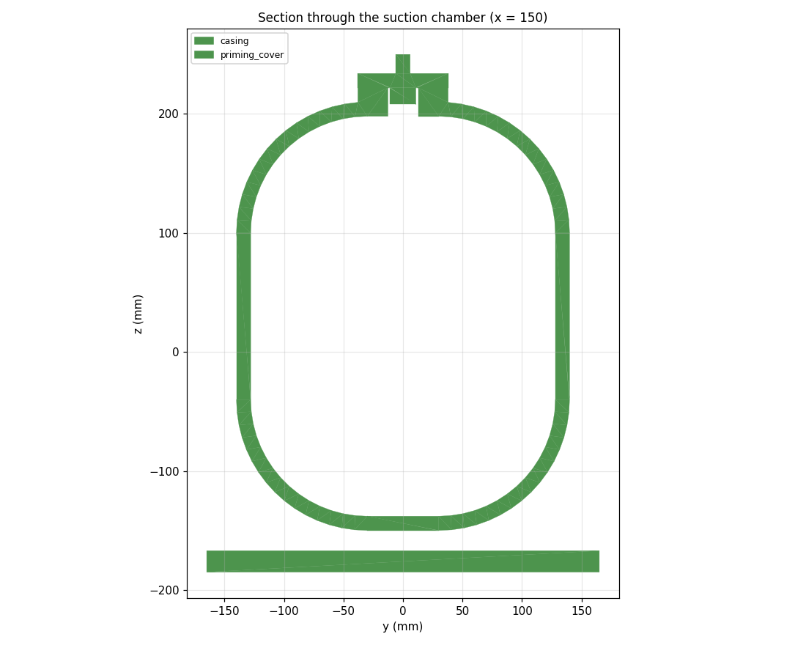

# Victor Pumps S 80: parametric model of the real pump

`pump_s80.py` models the **pump end** of the Victor Pumps S 80 self-priming centrifugal pump (DN80, 2900 rpm, 4 kW) as a bare-shaft pump: the casing with its real internal layout, the open impeller with curved blades, the wear plate, covers, check valve, bearing bracket, shaft, bearings and mechanical seal. No motor.

Unlike `../pump/` (a Taiga-S1 goal kit, limited to top-face features), this is direct CAD code. It is the **reference geometry** for extending Taiga-S1 to curved and internal features: its construction steps are the primitives Taiga would need to learn.



## Run

```bash
./build_pump_s80.sh            # generate the STEP parts, then assemble them in FreeCAD
```

or step by step:

```bash
uv pip install --python ~/taiga/taiga-s1/.venv/bin/python cadquery-ocp     # OpenCASCADE bindings, once
~/taiga/taiga-s1/.venv/bin/python pump_s80.py --out parts/pump_s80 --cutaway --preview
source ~/taiga/freecad.env
"$FREECAD_PYTHON" ../taiga_assemble.py --parts parts/pump_s80 --spec parts/pump_s80/pump_s80.json
```

The script needs only Python ≥ 3.10 with `cadquery-ocp` (OpenCASCADE 7.9, the same kernel as FreeCAD 1.1). It writes one STEP file per part, already in pump coordinates, plus `pump_s80.json` for `taiga_assemble.py`, which builds `pump_s80.FCStd` (and `pump_s80_exploded.FCStd`) with colors. `--cutaway` adds `casing_cutaway.step` (the casing cut in half, like the brochure's cutaway photo). `--preview` writes a 3D view and three cross-sections as PNG. Each part is checked: single valid solid, volume printed.

## Internal layout

Coordinates: shaft axis = X, impeller back face at x = 0, suction side towards +x, bracket towards −x.



From the motor side to the front, as in the brochure's cutaway photo and operating-principle figure:

1. **Rear wall** with the seal bore and a hub for the bearing bracket.
2. **Volute compartment** (40 mm wide). A spiral channel around the impeller grows from the cutwater (tongue) to the throat, then a tangential duct rises along the side into the separation chamber.
3. **Separation wall** with the impeller eye (Ø80). The wear plate bolts to it.
4. **Suction chamber** at the front, full height in front of a stepped wall. It holds the liquid reserve that makes re-priming possible. The **suction port** (DN80 PN16 flange) is high on the front face, with the **non-return valve** flap behind it. The **inspection opening** with its cover is below, the **drain** at the bottom and the **priming port** with its cover on top.
5. **Separation chamber** on top, above the volute and behind the stepped wall. Air separates here, and the liquid leaves through the **discharge port** (square flange) on top.



The section through the impeller shows the spiral volute, the cutwater and the duct rising to the separation chamber on the right, and the three backward-curved blades.



## Where the dimensions come from

The brochure gives the duty and the layout, but no internal dimensions. `design()` in the script derives them, and prints them on every run:

| Quantity | Value | Source |
|---|---|---|
| Speed, power, port | 2900 rpm, 4 kW, DN80 | Catalogue (S 80 / 81 row) |
| Duty point | ≈60 m³/h at ≈35 m | Read from the catalogue's DN80 performance chart |
| Impeller diameter D2 | 175 mm | Tip speed u2 = √(2gH/ψ), ψ ≈ 1 for open impellers |
| Blades | 3, logarithmic spiral, β = 22°, 11 mm thick | Typical open solids-handling impeller (photo); gap between blades 58 mm, more than the catalogue's 32 mm solids passage |
| Volute | Base circle 1.05 · r2, width 40 mm, throat area ≈1500 mm² (h ≈ 38 mm) | Stepanoff: throat velocity c3 = 0.42 √(2gH); area grows linearly with angle |
| Suction eye | Ø80 | DN80 |
| Shaft | Ø25 at the impeller, Ø35 at the seal and bearings, Ø28 drive end | Typical for 4 kW, 2 poles; 6207 bearings |
| Flanges | DN80 PN16 (Ø200, 8 × Ø18 on Ø160); square discharge flange | EN 1092-1; photos |
| Casing shape, walls (12 mm), chambers, covers, feet, bracket | — | Estimated from the photos and the cutaway |

All of these are parameters at the top of the script (`design()` and the constants under `# casing frame`).

## Simplifications

- **2.5D internals:** the volute has a rectangular cross-section, and the chambers are extruded outlines. A real casting has rounded, varying sections; that would need sweeps and lofts.
- **Fasteners:** no bolts or nuts. Bolt holes are modeled, threads are not.
- **Machined details:** the impeller has no balancing holes or cutter, the shaft has no threads, and the bearings and seal are plain rings.
- **Recirculation:** there is no separate recirculation passage. The separation chamber drains back to the volute through the throat duct.

## What this means for Taiga-S1

To build this casing and impeller itself, Taiga-S1 would need:

- **Curved outlines in sketches:** arcs (rounded body outline) and splines (volute spiral, blades).
- **Sketches on any plane or face**, not just the top face: side and front ports, internal walls (sections in the XZ plane), the rear hub.
- **Revolve with a profile**, for the bracket and shaft.
- **Pockets with a given depth** from any face, for the chambers.
- **Patterns of any feature**, e.g. the blades.

`pump_s80.py` uses exactly these operations, so its part builders double as a specification for the new goal types and teacher rules.
